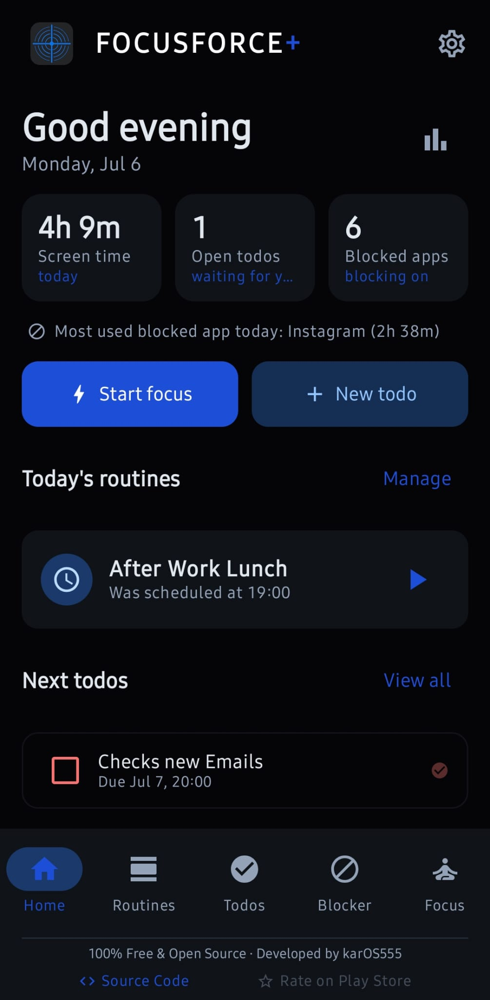
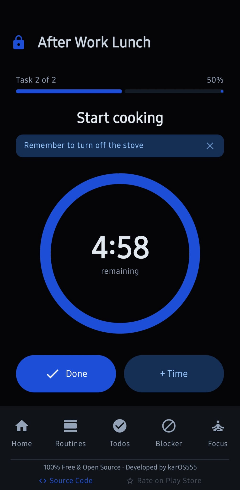
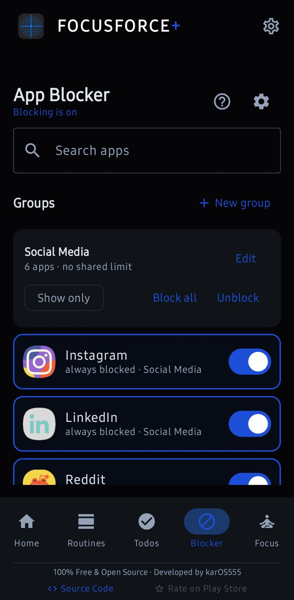
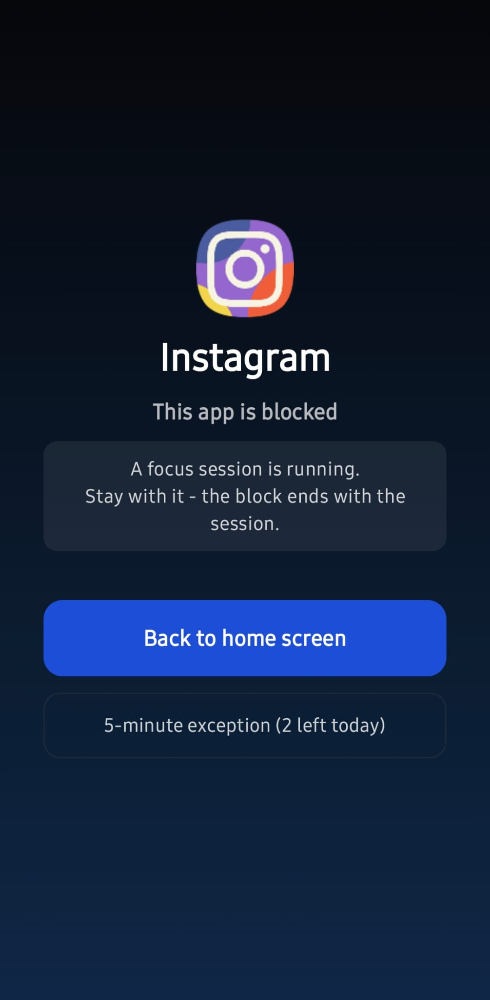

# FocusForce+

### Routines, to-dos, app blocking and focus mode in one app, with reminders that are hard to ignore.

 

 

No Play Store needed. Grab the latest APK and install it directly. [How to install](#install)

 

> [!NOTE]
> FocusForce+ is in public beta. Everything is built and it runs on real devices, but it hasn't had a wide test yet, so expect the odd rough edge. If you hit one, please [open an issue](../../issues), it really helps.

 

## What it is

FocusForce+ puts four things that usually live in four separate apps into one: strict **routines**, a nagging **to-do planner**, an **app blocker**, and a **focus mode**. The whole point is that it doesn't let you wriggle out of your own plans the second motivation dips.

I built it for people whose brains need more structure than most apps assume: ADHD, trouble reining in your own habits, or just losing too many hours to your phone. Honestly I'm building it mostly for myself, because I kept looking for something that tied all of this together and couldn't find one that fit.

Everything stays on your phone. No account, no cloud, no ads, no tracking. The app doesn't even ask for internet access.

 

## Screenshots

 
Home, an active routine, the app blocker, and a focus session.

 

## What's inside

**Routines.** Multi-step routines with a real alarm at the start time, a countdown for every step, and a heads-up before each one ends. Run over time and the timer keeps going into the negative and keeps reminding you.

**To-dos.** A planner that won't let things quietly slip. Timed to-dos alarm you like a routine does. Loose ones resurface a few times a day. Overdue ones stay pinned until you deal with them.

**App blocker.** Block distracting apps by a daily time limit, a fixed time window (overnight works too), or automatically during routines and focus sessions. Bundle apps into groups with one shared limit.

**Focus mode.** One session that turns on Do Not Disturb, silences notifications, and blocks the apps or groups you pick, for a set stretch of time. Start one on the spot or schedule it.

**Home dashboard.** Your day at a glance: today's routines and their status, the to-dos that need you next, screen time, and quick actions.

**Statistics.** A simple weekly view of routines completed and focus minutes logged.

 

## What makes it different

**Invincible Mode is per feature, not one big switch.**
Most blocking apps give you a single lockdown toggle. Here you turn it on for the individual routine, focus session, or blocking rule you actually want to commit to. Lock in the morning workout while leaving everything else flexible. While an invincible thing is active (routine running, session in progress, limit hit) you can't impulsively cancel or weaken it until it reaches its natural end.

**It's friction, not a trap.**
You can always uninstall the app from Android settings, and a factory reset always works. The goal isn't to lock you out of your own phone. It's to make bypassing annoying enough that a bad-day version of you doesn't do it for a dumb reason. The app is upfront about this everywhere it matters.

**Tamper Protection for the settings themselves.**
Optional second layer. When it's on, loosening your own lock settings only works inside a short daily window you choose, so you can't panic-disable everything in a weak moment.

**Actually local.**
No internet permission at all. Your data can't leave the device because the app has no way to send it. You can export and import everything as a plain JSON file whenever you want.

 

## Install

FocusForce+ isn't on the Play Store yet, so you install the APK directly.

1. Open [the latest release](https://github.com/karOs555/FocusForcePlus/releases/latest) and download the `.apk` file.
2. Open it on your phone. Android will ask permission to install from this source the first time. Allow it.
3. Follow the in-app setup guide. It walks you through the permissions each feature needs and explains what every one is for.

Minimum Android version is 8.0 (API 26).

### Getting updates

FocusForce+ has no internet access, so it can't check for updates itself (that's the point, your data can't leave the device). Two options:

- **Manual:** Settings > About > Check for updates opens the releases page, where you can see if there's a newer version and grab it.
- **Automatic:** install FocusForce+ through [Obtainium](https://github.com/ImranR98/Obtainium), an app that watches GitHub releases and updates sideloaded apps for you. Point it at this repo once and it handles the rest. The app stays offline, Obtainium does the checking.

> [!NOTE]
> Some permissions (accessibility for app blocking, usage access for time limits, Do Not Disturb for focus mode) are granted in Android's own settings. The setup guide takes you there and tells you exactly what each one does and doesn't do. Nothing is turned on behind your back.

 

---

 

<b>Tech stack</b>

 

| | |
|---|---|
| Language | Kotlin |
| UI | Jetpack Compose, Material 3 |
| Architecture | MVVM, Clean Architecture |
| Database | Room (local SQLite) |
| DI | Hilt |
| Background work | WorkManager, foreground services |
| Reminders | AlarmManager, NotificationCompat |
| App blocking | AccessibilityService, UsageStatsManager |
| Min SDK | 26 (Android 8.0) |

<b>Project status and roadmap</b>

 

The whole app is built and the first public beta is out. From here it's real-device testing, polish based on feedback, and eventually a Play Store submission.

- [x] Project foundation (Room, Hilt, navigation, dark theme)
- [x] Routines with timers, snooze logic, and Invincible Mode
- [x] To-do planner with the persistent reminder system
- [x] App blocker via AccessibilityService, with groups and time limits
- [x] Focus mode with Do Not Disturb
- [x] Onboarding and settings
- [x] Home dashboard and statistics
- [x] Tamper Protection, JSON backup, quick-settings tile
- [x] First public beta
- [ ] Stable 1.0 after a testing round
- [ ] Play Store submission

Later ideas: home-screen widgets, calendar sync, a Pomodoro mode, streaks and gamification.

<b>Privacy</b>

 

Everything runs on your device. The app collects nothing, sends nothing, and has no analytics, crash reporting, or ad SDKs. It has no internet permission.

Permissions are used only for the feature they belong to: accessibility to see which app you opened (so it can be blocked, it never reads screen content), usage access to measure app time for limits, Do Not Disturb access for focus sessions, alarms and notifications for reminders.

Full details are in [PRIVACY.md](PRIVACY.md).

<b>Contributing</b>

 

Bug reports, ideas, and pull requests are all welcome, especially notes on how the app behaves on your device during the beta. See [CONTRIBUTING.md](CONTRIBUTING.md) for how to get set up and the few ground rules the project sticks to.

<b>Credits</b>

 

The code is written from scratch in Kotlin, but the ideas and some of the architecture lean on a few great open projects:

- [Mindful](https://github.com/akaMrNagar/Mindful) by akaMrNagar, for the app-blocking and invincible-mode concepts
- [MindMaster](https://github.com/ArmanKhanTech/MindMaster) by ArmanKhanTech, for blocking modes and Kotlin patterns
- [Curbox / DigiPaws](https://github.com/nethical6/digipaws) by nethical6, for gamified blocking ideas
- [Routinery](https://play.google.com/store/apps/details?id=com.routinery.routinery), for routine-execution UX

 

## License

GNU General Public License v3.0. See [LICENSE](LICENSE). You're free to use, study, change, and share the app and its code. Anything built on top has to stay open under the same license, with the original credit kept.

 

## A note on health

FocusForce+ is a self-help tool for building focus and habits. It is not a medical device and does not diagnose, treat, cure, or prevent ADHD or any other condition, and it is not a substitute for professional care. If you're struggling, please talk to a qualified healthcare professional.

 

## Contact

Bugs and ideas go in the [Issues](../../issues) tab.

 

---

Built with care for minds that need a little extra structure.

