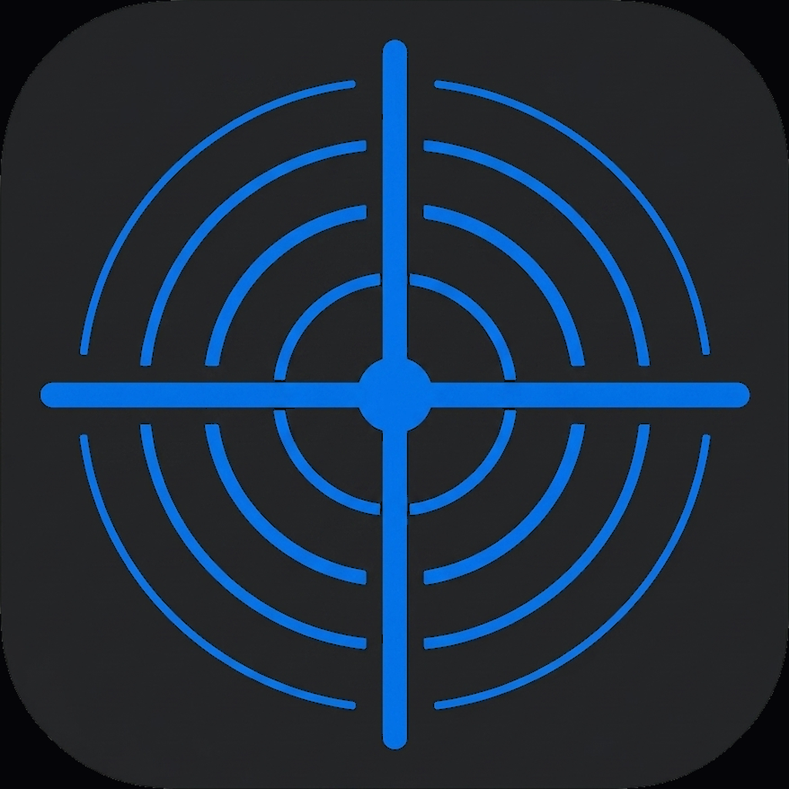

# FocusForce+

### An Android companion for focus, routines, and digital discipline.

 

 

 

> [!WARNING]
> **Work in progress.** There is no usable release yet. A Google Play release is planned once the app reaches a stable, functional state. Watch the repo to get notified when the first beta drops.

 

## About

FocusForce+ is a free and open source Android app built for people struggling with ADHD, poor self-discipline, or smartphone addiction. It's something I'm building in part because I deal with these things myself and couldn't find a tool that actually fit. There are plenty of apps that do one piece well, but none of them tie it all together, and most of them are too easy to wriggle out of the moment motivation dips.

So FocusForce+ combines the features of several existing tools (routine tracker, to-do planner, app blocker, and focus mode) into one cohesive, intentionally persistent system. Where other apps let you cancel with one tap, FocusForce+ is designed to hold you accountable. Snoozes are limited. Cancellations require confirmation. An optional **Invincible Mode** locks features so your future self can't undo what your present self committed to.

All data stays 100% on your device. No tracking, no cloud, no ads.

 

## The four modules

<table>
<tr>
<td width="50%" valign="top">

### Routines

Custom routines with multi-step timers, alarm-style wake-ups, and persistent reminders when you run over time.

- Per-subtask countdown timers
- Full-screen alarm notifications
- 3-minute warning before each step ends
- When time's up: timer runs into the negative with reminders every 5 minutes
- Snooze capped at 2, with choosable intervals
- Optional Invincible Mode removes the cancel button

</td>
<td width="50%" valign="top">

### Todos

A planner that won't let things quietly slip. Scheduled todos alarm you like routines do. Unscheduled ones surface three times a day in a digest.

- Alarm-style reminders for timed todos
- Morning, afternoon, evening digest for loose items
- Overdue todos become persistent notifications
- Same snooze and reschedule rules as routines
- Recurring todos (daily, weekly, monthly)

</td>
</tr>
<tr>
<td width="50%" valign="top">

### App blocker

Block distracting apps by daily limit, time window, or automatically during routines and focus sessions.

- Per-app daily time limits
- Scheduled time windows (e.g. 9 to 17)
- App groups like "social media"
- Custom overlay when a blocked app opens
- Invincible Mode prevents disabling once the limit is hit

</td>
<td width="50%" valign="top">

### Focus mode

One toggle that combines Do Not Disturb, notification blocking, and the app blocker for the duration of a session.

- Session types: study, work, creative, custom
- Countdown or stopwatch mode
- Optional auto-DND and notification silencing
- Schedule recurring sessions or start ad-hoc
- Session history and streak tracking

</td>
</tr>
</table>

 

## Tech stack

| | |
|---|---|
| **Language** | Kotlin |
| **UI** | Jetpack Compose, Material 3 |
| **Architecture** | MVVM + Clean Architecture |
| **Database** | Room (local SQLite) |
| **DI** | Hilt |
| **Background** | WorkManager, Foreground Services |
| **Notifications** | AlarmManager, NotificationCompat |
| **App blocking** | AccessibilityService, UsageStatsManager |
| **Min SDK** | 26 (Android 8.0) |

 

## Roadmap

- [x] **Phase 1** — Project foundation: Room DB, Hilt, navigation, dark theme
- [x] **Phase 2** — Routines system with timers, snooze logic, and invincible mode
- [ ] **Phase 3** — Todo planner with persistent reminder system
- [ ] **Phase 4** — App blocker via AccessibilityService
- [ ] **Phase 5** — Focus mode with DND integration
- [ ] **Phase 6** — Onboarding and settings
- [ ] **Phase 7** — Home dashboard
- [ ] **Phase 8** — Polish, integration, first beta
- [ ] **Phase 9+** — Gamification, widgets, calendar sync, Pomodoro, habit tracker, export and import

 

## Contributing

The project is not ready for external contributions yet. The codebase is changing rapidly and a lot of the foundational pieces are still being figured out. Once the app is functional and has a stable structure, I'll open it up properly with contribution guidelines, good-first-issue labels, and a map of areas where help is needed.

In the meantime, if you spot something or have an idea, feel free to open an issue. See [CONTRIBUTING.md](CONTRIBUTING.md) for the current status.

 

## Credits and inspiration

The code is original and written in Kotlin from scratch, but the concepts and architectural approaches draw on several excellent apps and projects:

- **[Mindful](https://github.com/akaMrNagar/Mindful)** by akaMrNagar — app blocking concept and invincible mode idea *(Apache 2.0)*
- **[MindMaster](https://github.com/ArmanKhanTech/MindMaster)** by ArmanKhanTech — blocking modes and Kotlin patterns *(MIT)*
- **[Curbox / DigiPaws](https://github.com/nethical6/digipaws)** by nethical6 — gamified blocking approaches *(GPL 3)*
- **[Routinery](https://play.google.com/store/apps/details?id=com.routinery.routinery)** — routine execution UX inspiration *(closed source)*

 

## License

Licensed under the **GNU General Public License v3.0**. See [LICENSE](LICENSE) for the full text.

In short: you are free to use, study, modify, and share the app and its code. Any derivative work has to stay open source under the same license, and the original attribution has to be preserved.

 

## Contact

Bugs and feature ideas go in the [Issues](../../issues) tab. General discussions will move to GitHub Discussions once the first beta is out.

 

---

Built with care for minds that need a little extra structure.

