

 
 

# FocusForce+

### The all-in-one app for ADHD brains, and anyone who wants more structure

Routines, todos, lists, an app blocker, focus and sleep mode in one Android app. With reminders you can't just swipe away.

 

 

&nbsp;

<!-- Enable once FocusForce+ is listed on F-Droid.

-->

Not in an app store yet. [How to install](#install)

 

> [!IMPORTANT]
> **Install it with Obtainium.** Then Play Protect lets it through, and Obtainium keeps the app up to date. [Here is how](#install-with-obtainium), in four steps.
>
> If you open the plain APK instead, Play Protect blocks it on many phones: "App blocked to protect your device". **That is a false alarm.** Google blocks every app from outside a store that has an accessibility service, and the app blocker needs one. It says nothing about this app: FocusForce+ is open source and works fully offline. It has no internet permission, so nothing can leave your phone.

> [!NOTE]
> FocusForce+ is in public beta. If something breaks or feels wrong on your phone, please [open an issue](../../issues).

<h2 id="in-short"> In short</h2>

- **One app instead of six.** Routines, todos, lists, blocker, focus and sleep work together. A routine can block your apps. A todo can carry your shopping list.
- **It holds you to your plan.** Reminders come back. Snoozing, skipping and quitting early take a small task first, like solving a sum.
- **It stays on your phone.** No account, no cloud, no ads. The app has no internet permission.
- **Free and open source.** Built by one person who uses it every day.

<h2 id="why-i-built-it"> Why I built it</h2>

**I built FocusForce+ for myself.** Every routine app, todo app and blocker I tried stopped working the moment my motivation dipped. I could swipe everything away, snooze forever, or switch it off in two taps.

So I wrote the app I needed. I use it every day.

<h2 id="who-it-is-for"> Who it is for</h2>

ADHD is what the app was built around. But you don't need ADHD, or any label, to get something out of it.

| If you... | this is what helps |
|---|---|
| **have ADHD** | Structure from outside: alarms that start things, one step at a time, reminders that don't give up. |
| **keep putting things off** | "Later" gets harder: todos ring again, and snoozing takes a small task first. |
| **lose hours to your phone** | Limits, schedules and blocks that are not switched off in two taps. |
| **just want a day that runs** | A plain routine timer, todo list, shopping list and focus timer in one app. The strict parts are all optional. |

<h2 id="how-it-holds-you-to-it"> How it holds you to it</h2>

Most apps let you swipe, snooze or switch off. FocusForce+ puts a small hurdle in front of every way out.

<a href="docs/readme/shots/sum.png">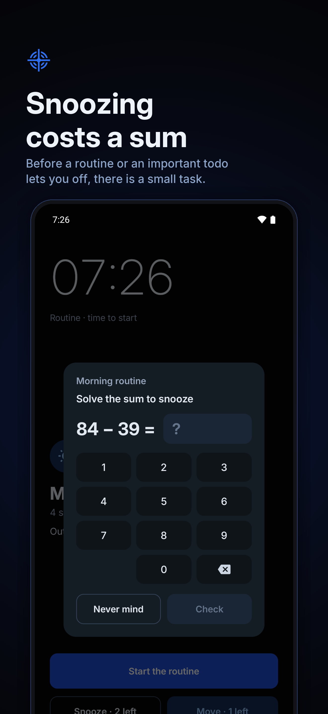</a>
&nbsp;
<a href="docs/readme/shots/blocked.png">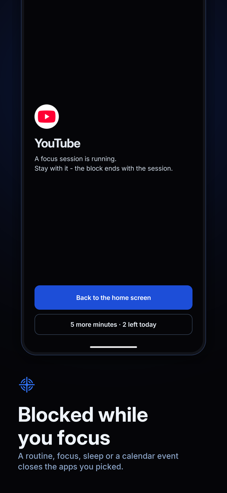</a>
&nbsp;
<a href="docs/readme/shots/invincible.png">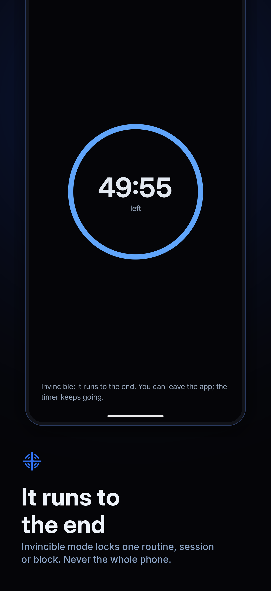</a>

| | What it does |
|---|---|
| **Speed bumps** | Before you snooze, skip, quit early or pause a block, the app can ask again, make you wait, or give you a small task: hold a button, drag a slider, trace a path or solve a sum. |
| **Blocking that follows your day** | Start a routine or a focus session and your apps close with it. Sleep time and calendar events do the same. |
| **Invincible mode** | Lock one routine, one focus session or one block. It then runs to the end. The rest of your phone stays free. |
| **Reminders that come back** | Swipe an important todo away and it returns. A high-priority todo rings again every few minutes. |
| **Tamper Protection** | Switch it on, and you can only loosen your locks in a short daily window. You pick the time. |

&nbsp;
<a href="docs/readme/shots/speedbumps.png">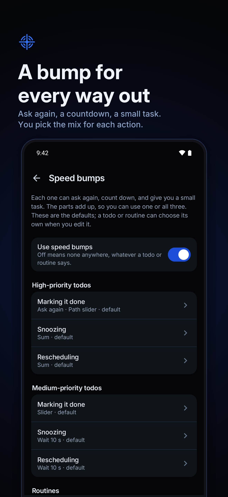</a>
&nbsp;
<a href="docs/readme/shots/tamper.png">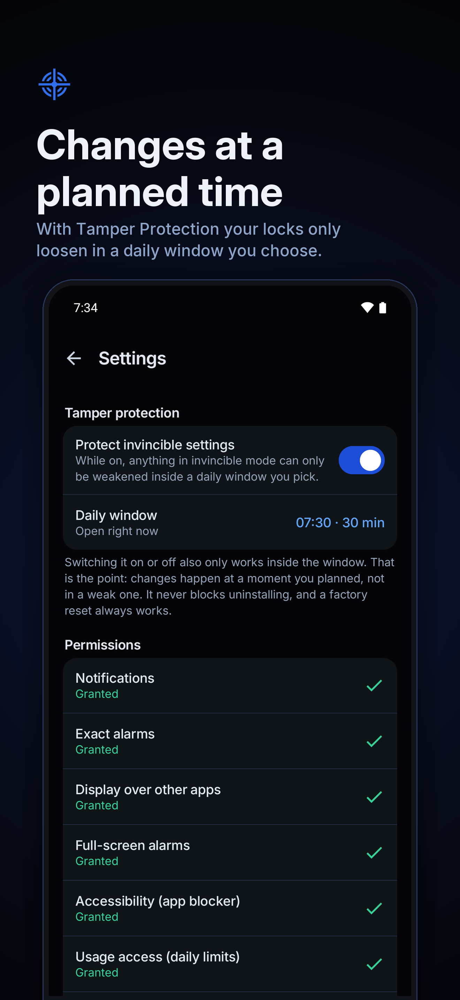</a>

**You decide how strict it is.** Every speed bump can be changed, for each action and even for a single todo or routine. One switch turns them all off.

> [!TIP]
> **Friction, not a trap.** A speed bump takes a minute at most. No alarm rings forever. You can always uninstall the app in Android's settings. The point is to stop the reflex, not to lock you out of your phone.

<h2 id="what-is-inside"> What is inside</h2>

<h3 id="home-and-todos"> Home and todos</h3>

**Home** answers one question: what now?

- How much of today is done, and what is up next, with **Start** or **Done** right there.
- Routines, todos and calendar events in **one list**, sorted by time.

**Todos** get louder with their priority.

| Priority | What happens |
|---|---|
| Low | One quiet notification. |
| Medium | Comes up on screen and comes back a couple of times. |
| High | Rings like an alarm, and rings again every few minutes. Ticking it off takes a confirmation and a swipe along a path. |

- **Todos without a date** come back at set times each day, so they don't sink to the bottom of a list.
- Checklists inside a todo, repeating todos, and a trash for mistakes.

<a href="fastlane/metadata/android/en-US/images/phoneScreenshots/1.png">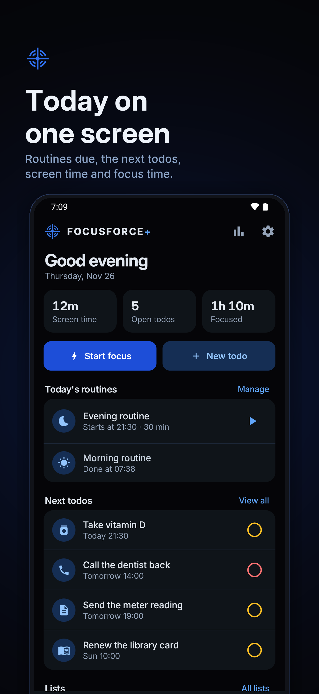</a>
&nbsp;

<h3 id="routines"> Routines</h3>

A routine is a list of steps. Each step has its own timer.

- **Starts with a real alarm,** full screen, like an alarm clock.
- **One step at a time.** Run over, and the timer keeps counting and reminds you.
- **Snoozing costs a sum.** You set how many snoozes each routine gets.
- Can **block apps** and switch on **Do Not Disturb** while it runs.
- A step can carry a list, like a packing list for "Pack the bag".
- Duplicate a routine, or copy steps from another one.

<a href="docs/readme/shots/routine-alarm.png">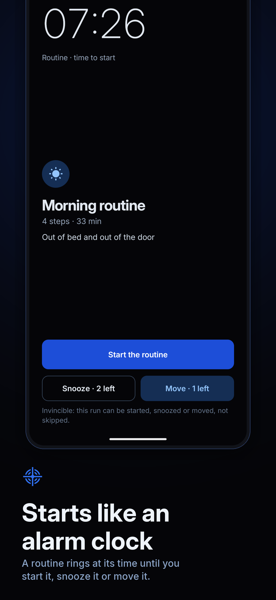</a>
&nbsp;
<a href="fastlane/metadata/android/en-US/images/phoneScreenshots/4.png">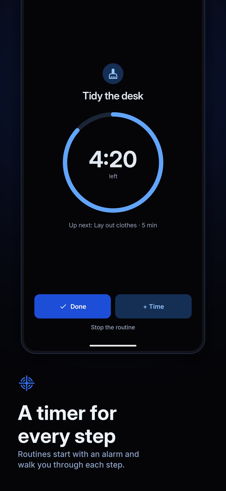</a>

<h3 id="lists"> Lists</h3>

Two kinds, because shopping and packing work differently.

**Shopping list**

- Type several things at once: `milk, 2 bread, flour 500 g`.
- **Sorts itself by aisle.** It knows common groceries in English and German.
- **Buy again:** what you bought before is one tap away.
- **A view for the shop:** only what is left, in big rows, with the screen kept on.

**Checklist**

- For the same things every time, like packing or leaving the house.
- Ticked items stay, and the top shows how far you are.
- **Start over** resets it for the next trip.

Both can remind you with a todo, be shared as text, and undo what you removed.

<a href="fastlane/metadata/android/en-US/images/phoneScreenshots/8.png">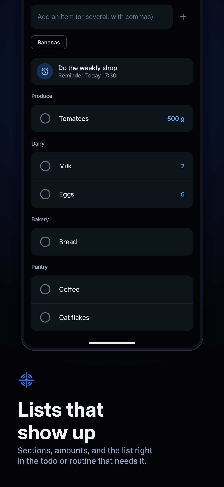</a>
&nbsp;
<a href="docs/readme/shots/shopping.png">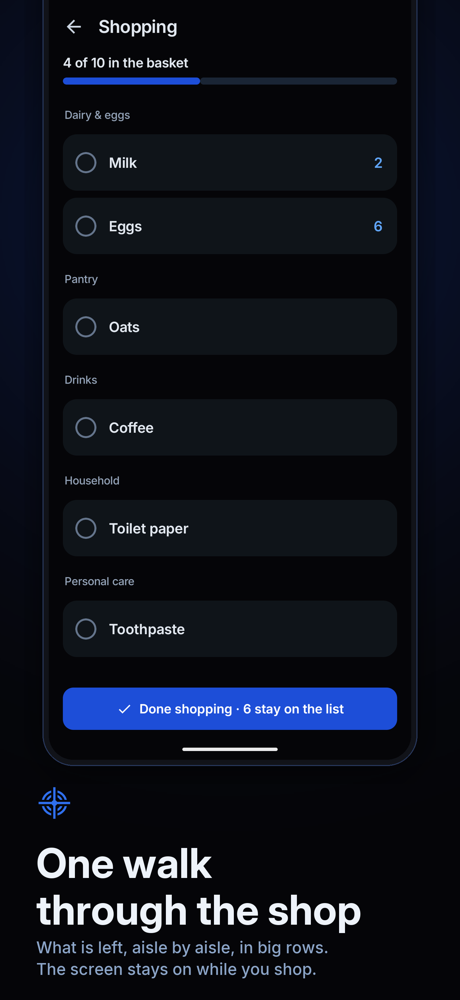</a>
&nbsp;
<a href="docs/readme/shots/checklist.png">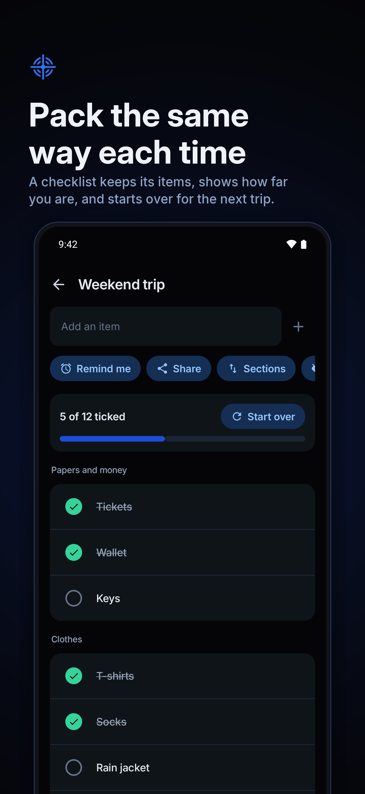</a>

<h3 id="blocker-focus-and-sleep"> Blocker, focus and sleep</h3>

**The blocker** closes the apps you pick:

- **always**, after a **daily limit**, or on a **schedule**, overnight too
- while a **routine**, a **focus session** or a **calendar event** is on
- with **one shared limit** for several apps, like 60 minutes for all social media
- or only **Reels and Shorts**, while the rest of Instagram and YouTube keeps working

Need an app anyway? "5 more minutes" is there a couple of times a day, after a short wait.

**Focus** silences the phone and blocks apps for a set time. Ending early asks first, then makes you wait.

**Sleep** reminds you to wind down, keeps the night quiet and closes apps until morning. It can start a routine at bedtime and at wake-up.

&nbsp;

&nbsp;

<h3 id="statistics-widgets-and-themes"> Statistics, widgets and themes</h3>

- **Statistics** compare your last seven days with the seven before: focus time, routines, todos and screen time, with streaks.
- **Widgets** put today, quick focus and a list on your home screen.
- **Themes:** six ready-made ones, two of them light, or your own colours. **Aero** is a real Frutiger Aero style: glass cards and liquid glass buttons over a summer sky, a green meadow and soap bubbles.

<a href="docs/readme/shots/stats.png">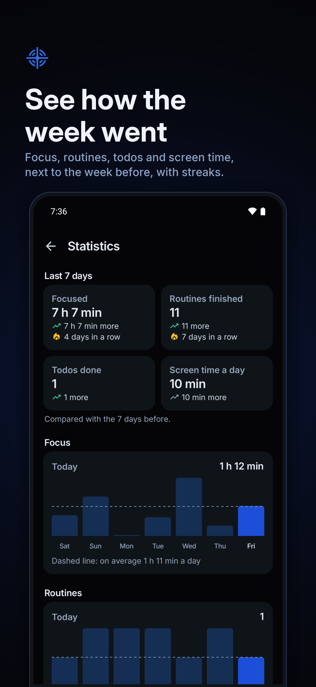</a>
&nbsp;
<a href="docs/readme/shots/widgets.png">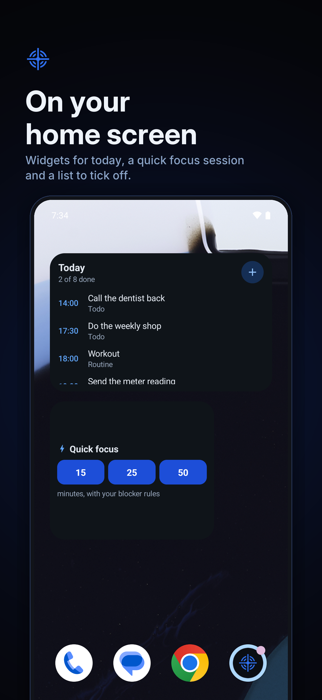</a>
&nbsp;

<h3 id="and-more"> And more</h3>

| | |
|---|---|
| **Your own bar** | Choose which modules sit in the bottom bar and in which order, or switch a module off. |
| **Calendar** | Today's events on Home, todos with a date in a calendar you pick, and blocking during events. |
| **Tasks apps** | Two-way sync with OpenTasks or Tasks.org. With DAVx5 it reaches Nextcloud and any CalDAV server. |
| **Sharing** | Share text from any app to make a todo or list items. |
| **Start links** | `focusforceplus://` links start focus or a routine from Tasker, shortcuts or NFC tags. Off until you switch them on. |
| **Backups** | Every night into a folder you choose, or one file by hand. An import can be undone. |

Everything stays on your phone. There is no account and no cloud, and the app has no internet permission.

<h2 id="install"> Install</h2>

FocusForce+ needs Android 8.0 or newer. It is not in an app store yet, so there are two ways to get it.

<h3 id="install-with-obtainium">Recommended: with Obtainium</h3>

[Obtainium](https://github.com/ImranR98/Obtainium) is a free, open source app. It installs apps straight from their GitHub releases.

| Why this way | |
|---|---|
| **Play Protect lets it through** | Obtainium installs the way an app store does, so the block described further down does not come. |
| **Updates without searching** | FocusForce+ has no internet access and can't look for updates. Obtainium checks for new versions and installs them for you. |

1. **Get Obtainium.** Download it from [its releases page](https://github.com/ImranR98/Obtainium/releases) or from [F-Droid](https://f-droid.org/packages/dev.imranr.obtainium.fdroid/) and install it. On the releases page, `app-arm64-v8a-release.apk` fits almost every phone.
2. **Add FocusForce+.** On your phone, open **[this link](https://karos555.github.io/FocusForcePlus/obtainium.html)**. Obtainium opens and asks "Import app". Tap **Continue**.
3. **Install it.** Tap **FocusForce+** in Obtainium's list, then **Install**. The first time, Android asks whether Obtainium may install apps. Allow it.
4. **Set it up.** Open FocusForce+. The setup guide walks you through the permissions and says what each one is for.

> [!TIP]
> The link already switches on **Include prereleases**. FocusForce+ is in beta, so every version is a prerelease, and without that switch Obtainium finds none.

<b>Adding it to Obtainium by hand</b>

 

1. In Obtainium, tap **Add**.
2. Paste `https://github.com/karOS555/FocusForcePlus` as the **App source URL**.
3. Switch on **Include prereleases**. This one matters: while the app is in beta, Obtainium finds no version without it.
4. Tap **Add**, then **Install**.

<h3 id="install-the-apk">Or: the APK by hand</h3>

1. Open [the releases page](https://github.com/karOS555/FocusForcePlus/releases) and download the `.apk` file of the newest release, at the top.
2. Open the file on your phone. The first time, Android asks whether to allow installs from this source. Allow it.
3. The setup guide walks you through the permissions and says what each one is for.

> [!WARNING]
> **Play Protect blocks this on many phones.** The message reads "App blocked to protect your device", and it has no "Install anyway".
>
> It is a false alarm. Google blocks every APK from outside an app store that contains an accessibility service, and the app blocker needs one. It says nothing about what this app does.
>
> The simple way around is Obtainium, above. If you want the plain APK anyway:
>
> 1. **Pause the scan for the install.** Play Store > your profile picture > **Play Protect** > the gear > switch off **Scan apps with Play Protect**. Install the APK, then **switch the scan back on right away**.
> 2. **Or install over USB.** With Android's platform tools on a computer: `adb install` and the name of the downloaded file. Play Protect stays on.
>
> Check your download first: `SHA256SUMS.txt` is attached to every release. An update by hand can run into the same block.

> [!IMPORTANT]
> Blocking needs an accessibility service. Daily limits need usage access. Focus needs Do Not Disturb access. You grant these in Android's own settings, and the setup guide takes you there. Calendar and tasks apps are optional and only ask when you switch them on.

<h3 id="updates">Updates</h3>

- **With Obtainium:** nothing to do. It finds new versions and installs them.
- **Without it:** the app can't check by itself, because it has no internet access. **Settings > About > Check for updates** opens the releases page.

---

 <b>Tech stack</b>

 

| | |
|---|---|
| Language | Kotlin |
| UI | Jetpack Compose, Material 3, Inter, Glance for widgets |
| Architecture | MVVM with data, domain and presentation layers |
| Database | Room (SQLite on the device) |
| DI | Hilt |
| Background work | WorkManager, foreground services, AlarmManager |
| App blocking | AccessibilityService, UsageStatsManager |
| Calendar and tasks | Android's calendar provider, the OpenTasks provider |
| Min SDK | 26 (Android 8.0) |

 <b>Roadmap</b>

 

- [x] Routines, todos, blocker, focus and sleep mode
- [x] Home screen, statistics, backups, quick settings tile
- [x] First public beta
- [x] Speed bumps, lists, Reels and Shorts, themes, sharing and start links, nightly backups
- [x] Calendar, OpenTasks and Tasks.org, widgets, Frutiger Aero
- [ ] 1.0 after this testing round
- [ ] F-Droid and the Play Store

 <b>Privacy</b>

 

The app collects nothing and sends nothing. There is no analytics, no crash reporting and no ad SDK, and it has no internet permission.

Each permission belongs to one feature:

| Permission | What it is for |
|---|---|
| Accessibility, for the blocker | Only learns which app you opened. It reads nothing on the screen. |
| Accessibility, for Reels and Shorts (optional) | Only works inside Instagram and YouTube, and only looks for their short-video player. |
| Usage access | Measures app time for limits and statistics. |
| Do Not Disturb access | For focus, sleep and routines. |
| Calendar and tasks (optional) | Only the calendar and the list you pick. |

All details are in [PRIVACY.md](PRIVACY.md).

 <b>Contributing</b>

 

Bug reports, ideas and pull requests are welcome, and so are notes on how the app behaves on your phone. [CONTRIBUTING.md](CONTRIBUTING.md) explains the setup and the few rules the project sticks to.

 <b>Credits</b>

 

The code is written from scratch, but some ideas come from these projects:

- [Mindful](https://github.com/akaMrNagar/Mindful) by akaMrNagar, for app blocking and invincible mode
- [MindMaster](https://github.com/ArmanKhanTech/MindMaster) by ArmanKhanTech, for blocking modes and Kotlin patterns
- [Curbox / DigiPaws](https://github.com/nethical6/digipaws) by nethical6, for blocking ideas
- [Routinery](https://play.google.com/store/apps/details?id=com.routinery.routinery), for how a running routine should feel

The picture behind the Aero style, also in its screenshot, is put together from four photos: ["Cumulus Humilis Clouds - Tennessee, USA"](https://commons.wikimedia.org/wiki/File:Cumulus_Humilis_Clouds_-_Tennessee,_USA_-_July_7,_2014.jpg) by Lee Ann Ratledge ([CC BY 4.0](https://creativecommons.org/licenses/by/4.0/)), ["Xp Reloaded"](https://commons.wikimedia.org/wiki/File:Xp_Reloaded_(67866923).jpeg) by Marco Rosanova ([CC BY 3.0](https://creativecommons.org/licenses/by/3.0/)), ["Tall grass 404 HDR"](https://commons.wikimedia.org/wiki/File:Tall_grass_404_HDR.jpg) by Sam Renold Joshua (CC0) and ["The Blue Marble"](https://commons.wikimedia.org/wiki/File:The_Earth_seen_from_Apollo_17.jpg) by NASA (public domain). They were cropped and recoloured, and bubbles and light were drawn in. The [full note](app/src/main/assets/licenses/aero-photo.txt) ships with the app.

Icons in this README are from [Lucide](https://github.com/lucide-icons/lucide), used under the ISC License.

---

<h2 id="license"> License</h2>

GNU General Public License v3.0, see [LICENSE](LICENSE). Anything built on it has to stay open under the same license and keep the original credit.

<h2 id="a-note-on-health"> A note on health</h2>

FocusForce+ is a self-help tool for focus and habits. It is not a medical device, does not diagnose, treat, cure or prevent ADHD or any other condition, and does not replace professional care. If you're struggling, please talk to a qualified healthcare professional.

<h2 id="if-it-helps-you"> If it helps you</h2>

The app never phones home, so I can't tell whether anyone uses it. If it does something for you, a star on the repository or an [issue](../../issues) is the only way I find out. A bug, an idea, or one line saying it works: all of it helps.

 

Developed with the help of AI coding assistants.

